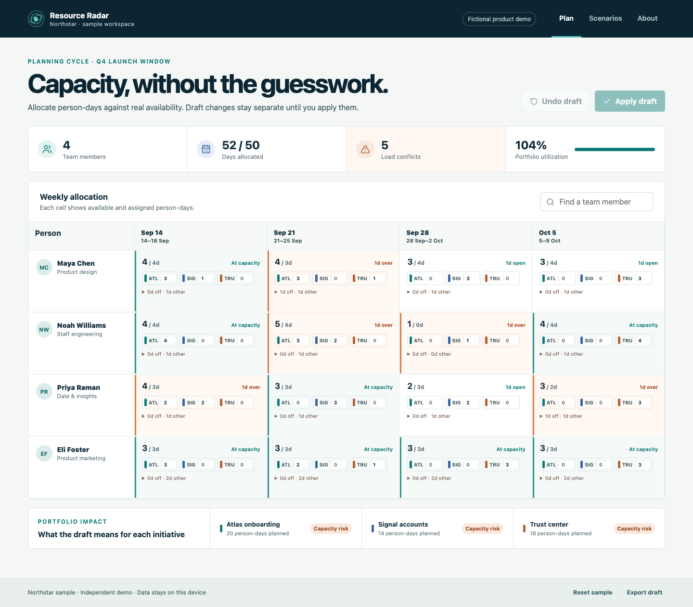

# Resource Radar

A product plan needs to fit the team's actual availability. This PM case study makes allocation tradeoffs visible before a commitment is made.

**[Try the demo](https://mvahedi2020.github.io/Resource-Radar/)** · [Product requirements](docs/product/PRD.md) · [Case study](docs/product/Case_Study.md) · [Evaluation plan](docs/product/Measures.md) · [Watch the workflow](docs/media/workflow.webm)

## Try this decision

Northstar, a fictional B2B SaaS company, has competing onboarding, account-insight and trust initiatives. Find Noah's zero-availability week, remove or move the conflicting work, and compare your draft with the baseline. Apply a deliberate choice or discard it; export the draft for discussion.

## My role

I owned the product work: problem framing, prioritization and tradeoffs, requirements, workflows, fictional sample-data design, acceptance criteria, and evaluation plan. [Start with the PM review packet](docs/product/PRD.md) for the product brief, decision rules, and testable acceptance criteria.

Google Antigravity and other AI tools assisted with implementation and verification. This is not a claim that I manually wrote the application code or managed an engineering team.

## PM review route

Start with the [PRD](docs/product/PRD.md), then review [product decisions](docs/product/Product%20Decisions.md), [discovery](docs/product/Discovery%20Plan.md), [validation](docs/product/Validation.md), and [risks](docs/product/Product%20Risks.md). These show the product work I owned: framing the decision, choosing tradeoffs, defining a fictional workflow, and specifying evidence for the next investment. Implementation was AI-assisted; I am not presented as the manual application-code author.

## Product decisions

| Choice | Rationale | Tradeoff |
|---|---|---|
| Person-days after time off and operating commitments | Make availability concrete | Estimates need a team conversation |
| Separate baseline and draft | Avoid accidental commitments | Applying a plan is an extra deliberate step |
| Show initiative consequences | Connect resource decisions to product scope | Capacity risk is not a delivery forecast |

## Working scope and limits

Edit weekly allocations, time off and non-project commitments. Inspect overload, zero availability and initiative risk. Compare, apply, discard or reset scenarios; export JSON. Applied plans persist in this browser. Drafts are intentionally not retained until applied.

All people and initiatives are fictional. No integrations, collaboration, staffing recommendations, productivity scores or burnout diagnoses are provided. This is independent of the other Northstar demos and does not synchronize with them.

## Product evidence

- [Product requirements — problem, users, decisions, workflow, acceptance criteria, and proposed measures](docs/product/PRD.md)
- [Case study — product framing and portfolio narrative](docs/product/Case_Study.md)
- [Control matrix](docs/product/Control_Matrix.md)
- [Proposed metrics and next research](docs/product/Measures.md)
- [Commercial hypotheses](docs/product/GTM_Strategy.md)
- [Implemented / next / later](docs/product/Sprint_Backlog.md)
- [Validation](docs/product/Validation.md)
- [Contributor setup](CONTRIBUTING.md)
